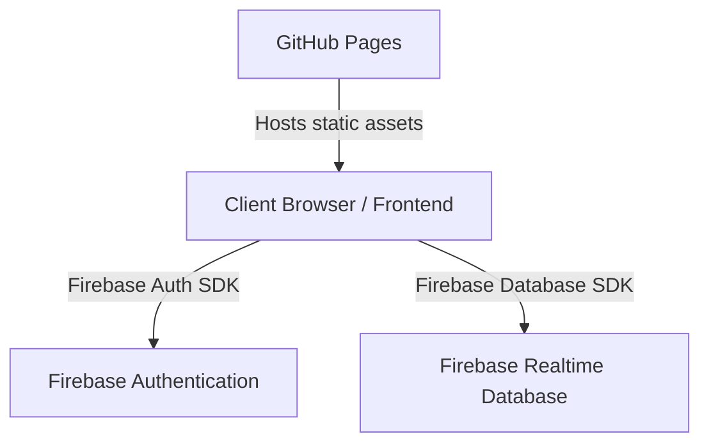

# Unistay System Architecture and Directory Layout (Report Section)

This document describes the structural organization of the Unistay Boarding Places Management System. 

## 🏛️ System Architecture Overview
The system is built on a **Serverless Architecture** using a **BaaS (Backend-as-a-Service)** paradigm. This design eliminates the need for maintaining a traditional server-side container (like Flask or Express), resulting in:
- High security and direct client-to-database communication.
- Low operational cost and compatibility with static hosting (GitHub Pages).
- Instant data synchronization (real-time chat and filters).



---

## 📁 Organized Folder Structure

```text
unistay/
├── css/                     # Styling Sheet Layer (Frontend Presentational)
│   └── style.css            # Global CSS styles (includes Responsive Media Queries)
│
├── js/                      # Logical Layer (Frontend controller & Services)
│   ├── firebase-config.js   # BaaS Client-SDK Connection & Config
│   ├── navbar.js            # Shared UI elements & Live Chat Notification Watcher
│   └── script.js            # Standard UI behaviors (dropdowns, toast system)
│
├── images/                  # Media & Graphic Layer
│   └── default_boarding.jpg # Fallback placeholder if property image is missing
│
├── [Root HTML Files]        # Interface Views Layer (Structure)
│   ├── index.html           # Landing page / Home
│   ├── auth.html            # Google & Email Authentication
│   ├── search.html          # Interactive listings search & distance filters
│   ├── explore_map.html     # Map integration view
│   ├── listing_detail.html  # Dedicated single property detail view
│   ├── messages.html        # Real-time chat system panel
│   │
│   ├── [Student Views]
│   │   └── student_dashboard.html # Saved listing bookmarks
│   │
│   └── [Owner Views]
│       ├── dashboard.html    # Manage/Add listings
│       └── edit_listing.html # Modify listing details
│
└── README.md                # Project documentation
```

---

## 📝 Layer Breakdown for the Report

### 1. View / Structural Layer (HTML5)
These are responsible for structural layout. They are divided logically by user roles:
- **General Access**: `index.html`, `auth.html`, `search.html`, `explore_map.html`, `listing_detail.html`, `messages.html`
- **Student Portal**: `student_dashboard.html`
- **Owner Portal**: `dashboard.html`, `edit_listing.html`

### 2. Presentational / Styling Layer (CSS3)
- Located inside `css/style.css`. It controls the grid systems, custom fonts (Outfit & Inter), glassmorphism, visual variables (colors, borders, gradients), and mobile media queries (`@media`).

### 3. Application Logic Layer (ES6 JavaScript modules)
- **`js/firebase-config.js`**: Replaces the traditional Backend Router. It directly initializes the Firebase App and exports helper instances for database methods (`set`, `get`, `update`, `onValue`).
- **`js/navbar.js`**: Dynamically injects headers/footers based on role state. It also contains the **Global Message Notification Watcher** which runs concurrently across all pages.
- **`js/script.js`**: Controls presentation behaviors such as toast alerts and drop-down menu animations.
